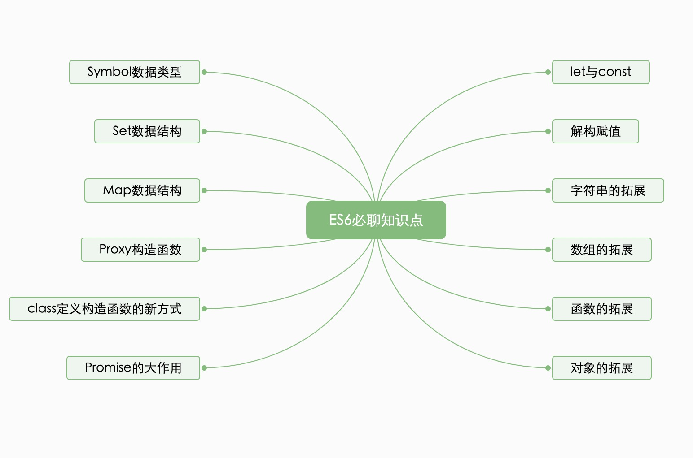

# ES6 简易指南

经过持续几年的磨砺,它已成为 JS 有史以来最实质的升级,特性涵盖范围甚广, 小到受欢迎的语法糖,例如箭头函数(arrow functions)和简单的字符串插值(string interpolation),大到烧脑的新概念,例如代理(proxies)和生成器(generators) 。ES6 将彻底改变程序员们编写 JS 代码的方式。

刚开始用 vue 或者 react，很多时候我们都会把 ES6 这个大兄弟加入我们的技术栈中。但是 ES6 那么多那么多特性，我们需要全部都掌握吗？秉着二八原则，掌握好常用的，有用的这个可以让我们快速起飞。

ES6必聊知识点如下，点击下一步我们开始学习吧！

::: tip
这是一个初学者的学习指南，欢迎交流，在我的[github](https://github.com/AqingCyan)上提issue。
:::
